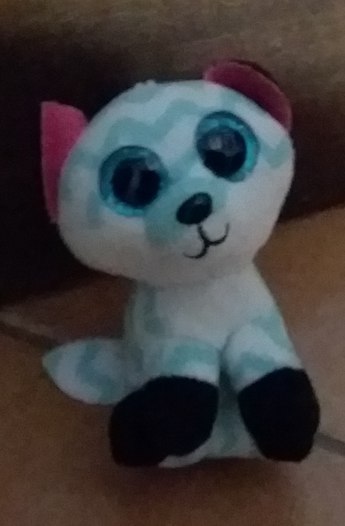

# La rencontre des parents de Chat-chien

## Personnages

Les personnages de cette histoire sont :

* La chatte (Nakoma, une peluche chat),
* Le chien (Cookie, une peluche client),
* Le directeur du concours (Une peluche ours),
* Le juge pour les épreuves (Une peluche tortue),
* Le bébé chat-chien (voir photo).

## Contexte

Le narrateur peut être soit un témoin de la scène, soit les deux parents de Chat-Chien, soit un autre protagoniste de l'histoire.

N'oubliez pas de faire participer l'enfant.

## Le concours du meilleur animal du monde

C’est l’histoire d’une chatte et d’un chien qui se rencontrent, avec d’autres animaux, pour un concours du meilleur animal du monde. Ce concours est composé d’épreuves physiques et mentales.

Après les éliminatoires, restent en lice la chatte et le chien. Ces deux derniers se détestent. Dès qu’ils en ont l’occasion, elle crache après lui et il aboie après elle.

Ils font toutes sortes d’épreuve et sont toujours ex-aequo :

* Le saut acrobatique avec un salto, puis deux, puis trois avec atterrissage sur la tête du directeur;
* Le jeu des questions;
* La course contre la montre où ils finissent avec le même temps à la seconde près;
* 100 bonds chronométrés au dessus de la tortue qui marche ;
* Et enfin le saut en longueur en simultané.

C’est dans cette dernière épreuve que les choses deviennent étranges. La chatte et le chat doivent sauter en même temps le plus loin possible. Or, ils arrivent toujours au même endroit au même moment. Le directeur leur dit qu’il faut qu’ils continuent jusqu’à ce qu’ils se départagent.

Ils sautent et sautent et sautent encore pour toujours finir par faire la même distance au centimètre près.

Au fur et à mesure des sauts, les deux animaux se rapprochent jusqu'a un saut où ils tombent l’un sur l’autre, le chien faisant involontairement un bisous à la chatte. Celle-ci crache et le directeur dit toujours : “ épreuve annulée ! Recommencez ! “

Puis c’est au tour de la chatte d'atterrir sur le chien et de lui faire involontairement un bisous. Il jappe. Mais toujours les deux recommencent, en crachant de moins en moins fort et en mettant de plus en plus de temps pour se relever.

Finalement, le directeur décide qu’il y aura deux gagnants ex-aequo pour la première fois du concours. La chatte et le chien crient et veulent chacun être le seul numéro un ! Le directeur crie : “alors il n’y aura pas de numéro un mais deux numéros deux ! “ Finalement la chatte et le chien décident que c’est mieux d’être numéro un ex-aequo.

Ils partent chacun de leur côté mais se bousculent involontairement et se font un bisou involontaire. Un peu groggy, ils partent dans l’autre sens chacun, se bousculent à nouveau et se refont un autre bisous involontaire.

Et ainsi de suite. Finalement, sous l’oeil du directeur, ils tentent un premier bisou volontaire. Puis un second qui dure plus longtemps puis un troisième.

Ils partent ensuite en décidant de se marier et de devenir le premier couple chat chien. De leur union naîtra miraculeusement le premier bébé chat-chien.

_Une photo de Chat-chien_

Tous les trois, ils vivront de grandes aventures.

_[Sous licence [GNU FDL](LICENSE.md "License")]_

