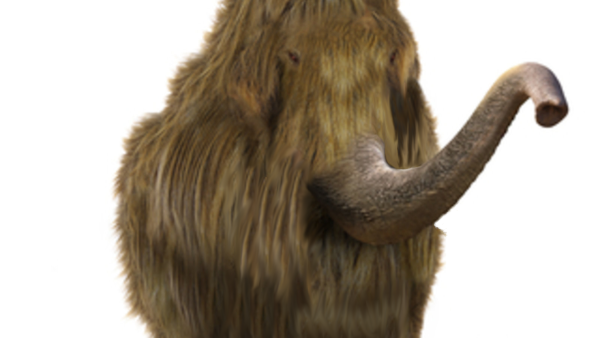
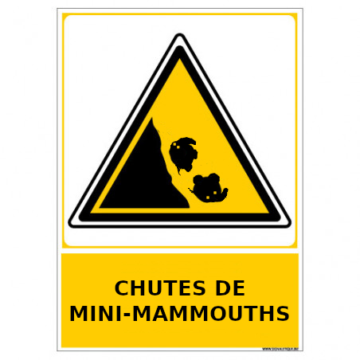
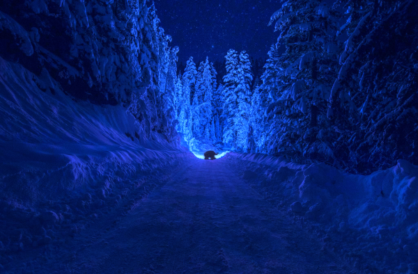
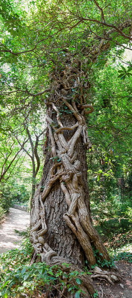
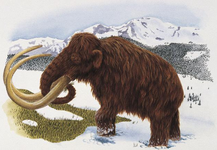
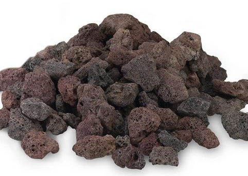

# Un animal peu connu : le mini-mammouth

## Habitat et espèces

Les minis-mammouths vivent dans certaines forêts de montagne, par exemple en Auvergne ou vers le col de Turini. Les minis-mammouths sont aussi hauts que des chiens de taille moyenne, type labradors, mais ils sont beaucoup plus trapus. Comme les mammouths, les mini-mammouths ont quatre pattes, une trompe, une queue courte, des oreilles petites comme les éléphants d'Asie, mais aucune défense.

_Figure 1 : Un mini-mammouth à poils longs_

Il existe deux espèces de mini-mammouths :
* Les mini-mammouths à poils courts
* Les mini-mammouths à poils longs.

Au fil des âges, les mini-mammouths à poil court ont quasiment disparu au profit des mini-mammouths à poils longs, mieux équipés pour résister au froid.

## Les poils longs, avantages et inconvénients

Les mini-mammouths à poils longs s'entravent souvent dans leurs poils, ce qui les fait tomber. S'ils tombent alors qu'ils étaient sur une pente montagneuses importante, ils se mettent à rouler en boule au travers des forêts pentues.

Il est dangereux pour les promeneurs de rencontrer un mini-mammouth entravé qui roule, le risque de collision étant important. Dans certaines forêts protégées, on trouve des panneaux avertissant les promeneurs.

_Figure 2 : Un panneau avertissant les promeneurs des éventuelles chutes de mini-mammouths_

## Une vie nocturne

Les mini-mammouths vivent plutôt la nuit et leurs yeux éclairent la forêt comme des phares de voiture.

_Figure 3 : un mini-mammouth la nuit sur un chemin en forêt_

Quand ils tombent le long d'une pente, entravés par leurs poils, on voit parfois des boules avec des lumières tournantes dévaler les pentes des montagnes d'Auvergne. Certaines personnes mal informées ont même pris les minis-mammouths pour des lucioles ou même des extra-terrestres, ce qui est ridicule.

## Habitudes alimentaires

Les mini-mammouths se nourissent de phasmes géants.

Dans certaines forêts, les phasmes géants ont la taille des arbres et il est bien difficile de les en distinguer. Surtout que, du fait de leur longevité (les phasmes géants peuvent vivre plusieurs milliers d'années), ils sont le plus souvent recouverts de lierre, et ce n'est que quand leurs yeux s'ouvrent dans des branches ou des troncs que l'on peut voir que ce sont des phasmes et non des arbres.

_Figure 4 : un phasme géant âgé de plus de cent ans accroché à un arbre_

Certains archéologues pensent que les Gaulois avaient domestiqué les phasmes géants et qu'il les utilisaient pour leur transport de marchandises. Mais ces animaux étant vraiment très lents, cette histoire paraît peu plausible.

## Traces des mini-mammouths dans l'histoire

Les premières traces de l'existence des mini-mammouths dont l'on dispose se trouvent ans la grotte de Rouffignac, dans le Périgord.

_Figure 5 : la première représentation de mini-mammouth de l'histoire_

Plus tard dans l'histoire, les archéologues ont trouvé des preuves montrant que, du temps des Gaulois, il existait des coiffeurs de minis-mammouths. Les vestiges archéologiques du plateau de [Gergovie](https://fr.wikipedia.org/wiki/Si%C3%A8ge_de_Gergovie "Gergovie") le confirment. Des chercheurs pensent que les mini-mammouths auraient pu être apprivoisés mais aucun indice ne confirme cette hypothèse.

On trouve aussi une représentation intéressante de mini-mammouth à poil court sur une mosaïque romaine. Ce dernier est harnaché comme les chevaux de guerre, ce qui laisse à penser qu'il s'agissait du jouet préféré du fils d'un riche tribun. Le mini-mammouth aura sans doute été rapporté des campagnes de Gaule.

_Figure 6 : un mini-mammouth utilisé comme un jouet chez les romains_

## Origine des mini-mammouths

Les mammouths sont une race d'êtres extraterrestres intelligents. Ils sont arrivés sur la Terre il y a environ cinq millions d'années, dans des navettes spatiales que les recherches n'ont pas encore permis de retrouver.

_Ci-dessus : une représentation de mammouth, le descendant du mini-mammouth_

Certains ont avancé l'hypothèse que l'arrivée des mammouths aurait provoqué la fin des dinosaures  mais les dates ne coïncident pas (les dinosaures ont disparu il y a environ 65 millions d'années).

Tout ce dont nous sommes certains est que le savoir du voyage spatial s'est progressivement perdu parmi les mammouths et que l'espèce s'est scindée en deux :
* Les éléphants ;
* Les mini-mammouths.

Aujourd'hui, seuls ces derniers se rappellent encore de l'ère glorieuse de la conquête spatiale. Tous les solstices d'été, les mini-mammouths entonnent le "chant des anciens" (des barrissements polyphoniques de toute beauté) en mémoire de leurs ancêtres, explorateurs galactiques.

## Créativité des minis-mammouths

Les minis-mammouths sont de grands artistes. A leurs moments perdus, ils construisent avec leur trompe des petites pyramides de pierre (ils ne sont pas très hauts eux-mêmes) en haut des montagnes qu'ils habitent. 

Ces pyramides, quand elles sont bien faites, réfléchissent le soleil pour appeler les vaisseaux spatiaux de leurs ancètres les mammouths. En effet, les mini-mammouths croient que leurs ancêtres reviendront un jour visiter la Terre et les emmèneront dans leur planète natale.

_Figure 6: une ébauche de pyramide de pierres de lave faite par un mini-mammouth pressé_

## Les mini-mammouths et l'électricité

Quand les mini-mammouths sont furieux, ils sont capables de lancer, avec leur trompe, une décharge électrique de plus de 1000 volts. Cette caractéristique leur a valu récemment beaucoup de problèmes, des écologistes voulant utiliser les mini-mammouths pour recharger leurs voitures électriques.

Après de nombreuses électrocutions, les pouvoirs publics ont établi des zones protégées pour que les mini-mammouths puissent vivre et se reproduire, sans être importunés.

## L'Association de Protection des Animaux Inconnus (APAI)

Aujourd'hui les mini-mammouths sont une espèce protégée. Ils sont souvent pris en charge par l'APAI, l'Association de Protection des Animaux Inconnus. Cette association possède un site non référencé par les moteurs de recherche (sur le "dark web") pour que les animaux inconnus le restent, et que ni les  médias, ni le grand public ne soit mis au courant de leur existence.

_[Dernière mise à jour : 20 février 2022. Sous licence [GNU FDL](LICENSE.md "License")]_

