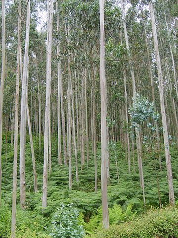

# Les mouchoirs à l’eucalyptus de Neptune

## La vérité sur Neptune

Ce n’est pas parce que Neptune est supposée être une planète froide balayée par des tempêtes incroyables que cette planète n’est pas une formidable source de vie.

De fait, sur Neptune poussent des eucalyptus géants, mesurant environ quelques dizaines de Tour Eiffel. Ils puisent leurs racines dans le sol profond de Neptune qui, étant une planète volcanique comme la Terre, possède un coeur chaud et beaucoup d'eau. Les feuilles de ces eucalyptus forment un treillis très serré et très épais entre le coeur de la planète et la couche de nuages glacials qui l'enveloppe, et dans laquelle se créent continuellement des tourbillons et des vents très puissants.

## Un monde en harmonie

Les eucalyptus maintiennent une bulle vivante autour du noyau de la planète, tout en masquant quasiment complètement la lumière du soleil. Pour autant, le jour et la nuit peuvent être distingués quand on se trouve sous les arbres.

Des lucioles géants se chargent de la lumière. Ces derniers sont des animaux volants doux et rêveurs qui font plus de lumière quand ils sont caressés, et émettent une légère lumière quand ils dorment.

Les habitants de Neptune, qui ressemblent beaucoup aux terriens mais qui ont la peau verte, vivent en harmonie avec la nature. La plupart d'entre eux vivent dans des maisons creusées dans la couche superficielle des arbres. Ils y accèdent par des escaliers accrochés posés sur le tronc des arbres.

Ils ne peuvent pas utiliser des maisons à même le sol en raison de la chute des feuilles et des écorces.

## La production des mouchoirs

Les neptuniens utilisent les débris des écorces et les feuilles gigantesques des eucalyptus pour fabriquer de la pâte d'eucalyptus qu'ils vendent à toutes les planètes du système solaire, dont la Terre.

Sur terre, cette pâte est utilisée pour faire les mouchoirs verts dont les gens se servent quand ils ont un rhume. Peu de gens savent que l'ingrédient principal des mouchoirs verts vient de Neptune, c'est pourquoi, il est important de le raconter aux enfants quand ils ont un gros rhume et qu'ils sont obligés de se moucher.

